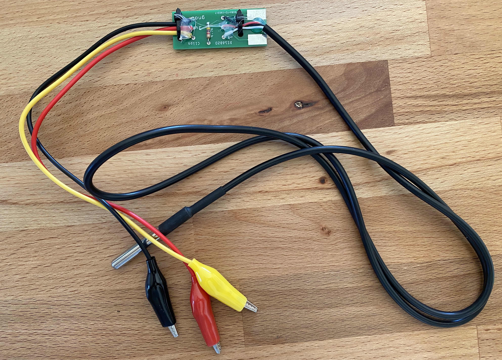
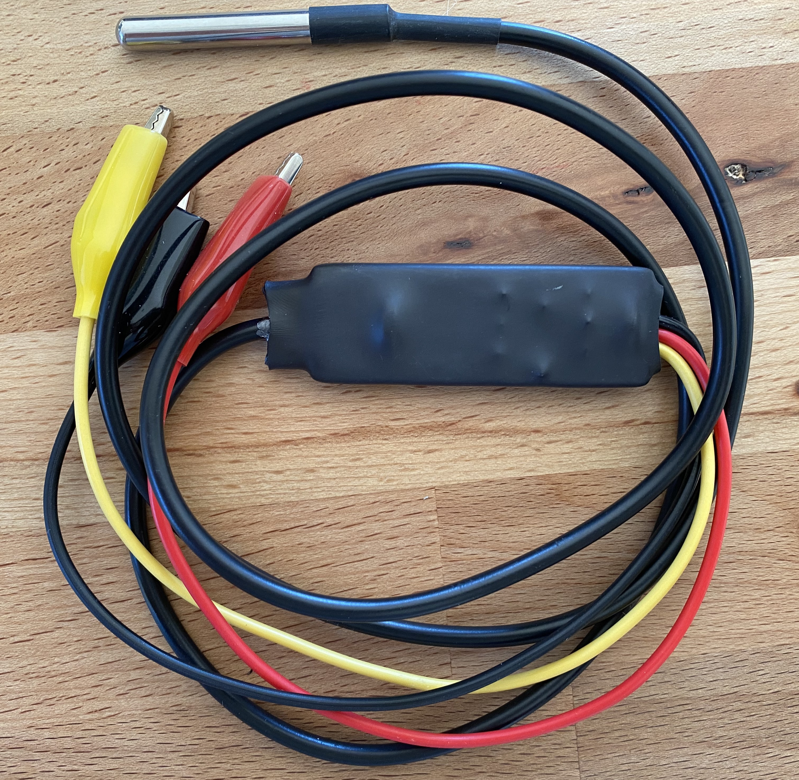
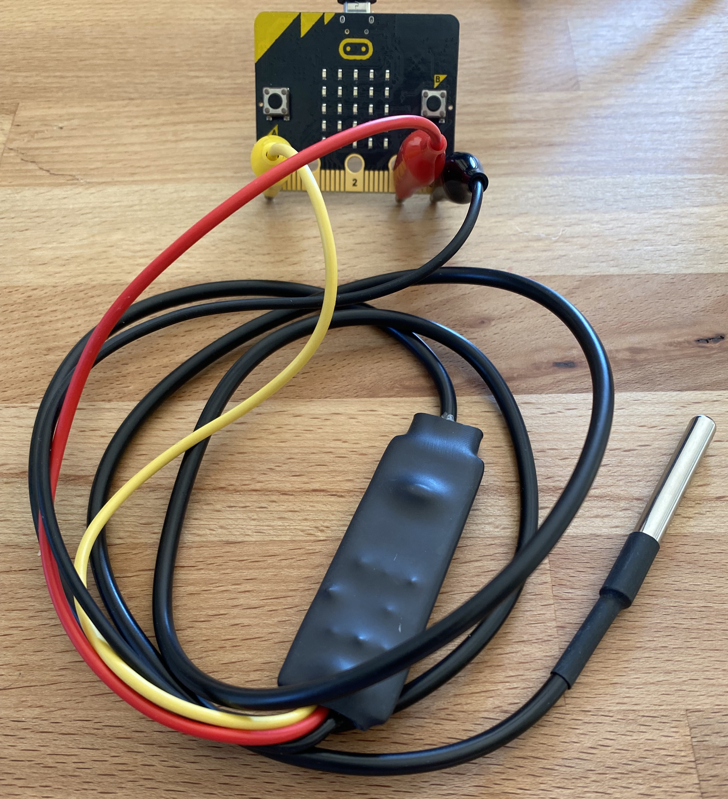

# DS18B20 Carrier Board for the Micro:bit

The DS1bB20Carrier.fzz is a carrier board that simplifies connecting the Dallas Semicnoductor (Maxim) DS18B20 sensor to a micro:bit. Major features:

* Support for connection via alligator clips
* Ensures robust wiring
* Includes the pull-up resistor

Here's a sheet detailing the sources of all parts and total costs: [https://docs.google.com/spreadsheets/d/1V1eAaYlWKphIdEfK43XVoJqUFalXNP_TMtNRYFkozos/edit?usp=sharing](https://docs.google.com/spreadsheets/d/1V1eAaYlWKphIdEfK43XVoJqUFalXNP_TMtNRYFkozos/edit?usp=sharing)

Here's an early prototype after assembly: 

Here's an assembled prototype with heat shrink around the PCB: 

And connected to the micro:bit: 

